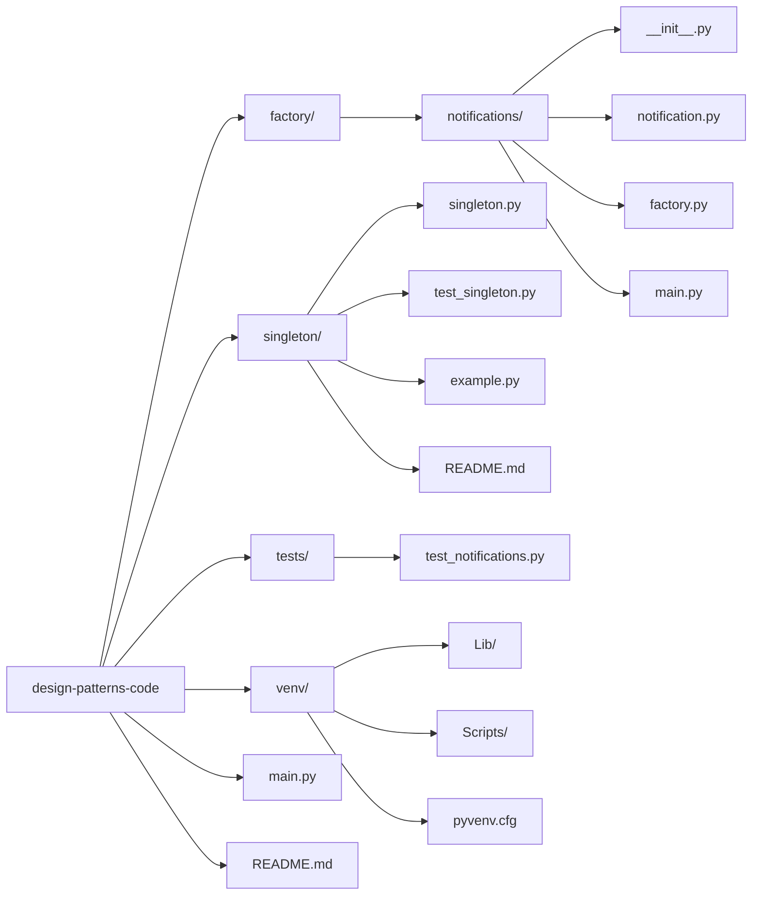

# 🎯 Design Patterns Code Examples

Welcome to **Design Patterns Code Examples**, a collection of simple and practical implementations of common software design patterns in Python.

The goal of this repository is to help you **understand**, **visualize**, and **experiment** with key design patterns by providing clean and minimal code examples.

---

## 📦 Available Patterns

### ✅ 1. Factory Pattern
**Purpose**: Encapsulates object creation logic.  
**Use Case**: When the client code should not need to know which specific subclass is being instantiated.

📁 Folder: `notifications/`

🧱 Files include:
- `notification.py`: Abstract base class and concrete notification types (e.g., Email, SMS).
- `factory.py`: Factory class that returns the appropriate object.
- `main.py`: Example usage.
- `tests/test_notifications.py`: Unit tests.

---

### ✅ 2. Singleton Pattern
**Purpose**: Ensures a class has only one instance and provides a global access point to it.  
**Use Case**: Useful for things like configuration managers or logging systems.

📁 Folder: `singleton/`

🧱 Files include:
- `singleton.py`: Basic singleton implementation.
- `main.py`: Demonstration of singleton behavior.

---

## 📂 Project Structure

