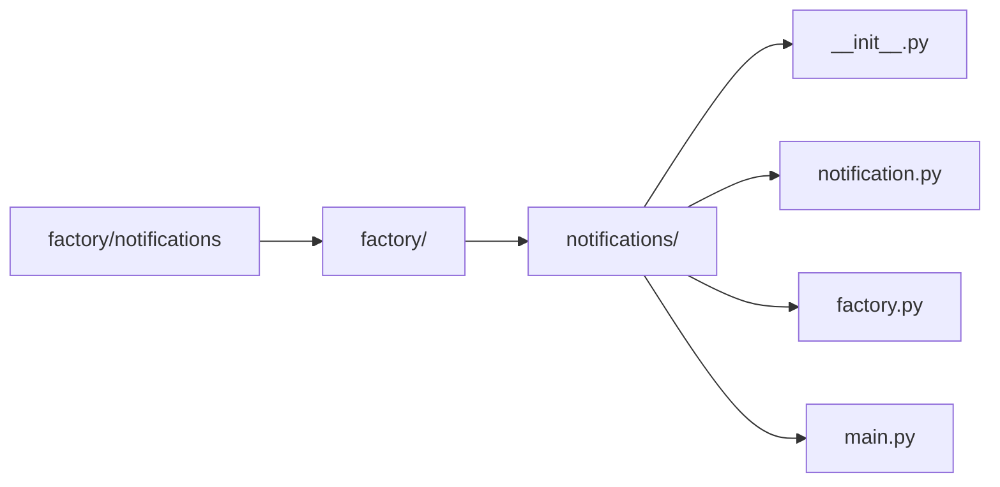

# Notification Factory Example

This project demonstrates the **Factory Design Pattern** using Python. The main purpose of this design pattern is to encapsulate the object creation logic, allowing clients to request objects without needing to know the specific class being instantiated.

## 🏗️ What is the Factory Pattern?

The **Factory Pattern** is a creational design pattern that provides an interface for creating objects in a superclass but allows subclasses to alter the type of objects that will be created.

In this example, the `NotificationFactory` class is responsible for creating different types of notification objects (like `EmailNotification` and `SMSNotification`) based on the provided input.

## 📁 Project Structure


## 📦 notifications/ Folder Breakdown

- `notification.py`:  
  Contains:
  - `Notification` (abstract base class)
  - `EmailNotification` (concrete class)
  - `SMSNotification` (concrete class)

- `factory.py`:  
  Contains:
  - `NotificationFactory`, which has a `create_notification()` method that returns a notification object based on a given string (`"email"` or `"sms"`).

- `main.py`:  
  Example usage. It gets the notification method from user input or command-line arguments and uses the factory to create and send a notification.

## 🚀 How to Run

1. **Activate your virtual environment** (if using one):
   ```bash
   source venv/Scripts/activate  # On Git Bash
