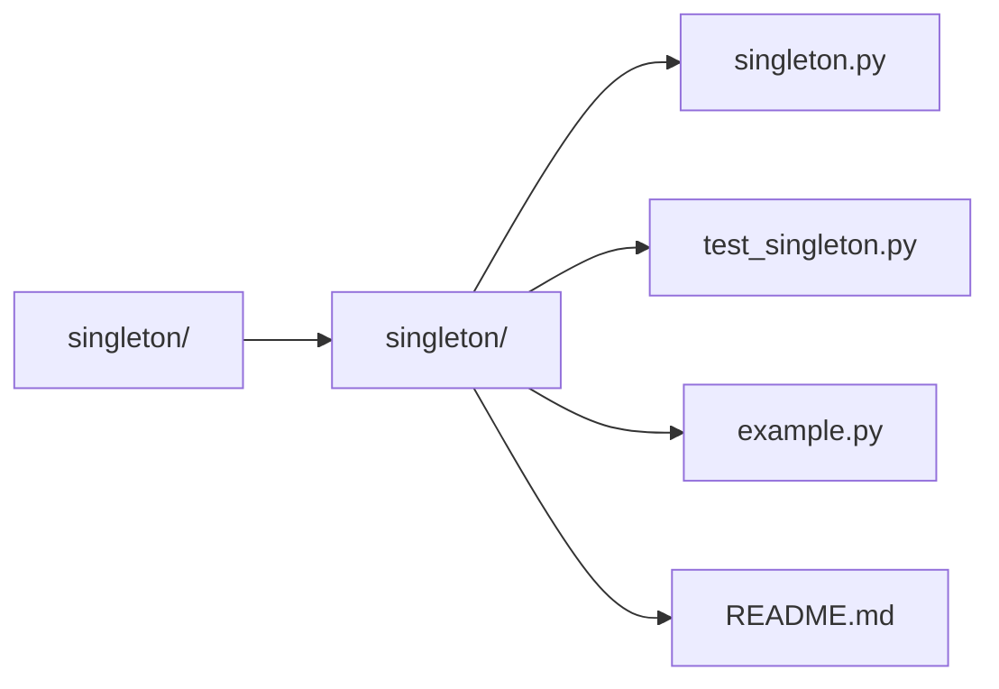

# Singleton Pattern

The Singleton pattern ensures that a class has only one instance and provides a global point of access to it.

## Use Case
Useful for things like:
- Logger
- Configuration manager
- Database connection

## How it works
- Overrides `__new__()` to control instance creation.
- Stores a single shared instance.

## Folder Structure
